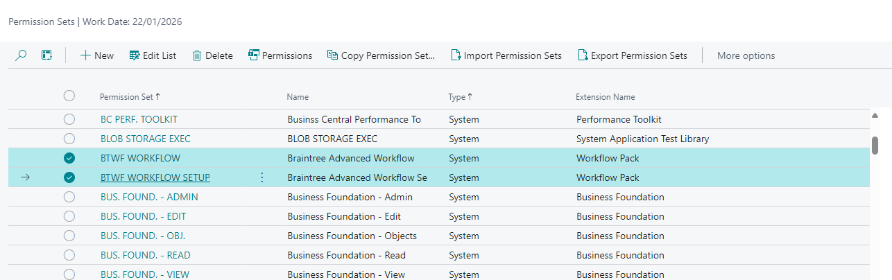

# Setup and Configuration
To start using the Workflow Templates Extension, some initial setup and configuration are required. These steps ensure that the workflows are tailored to your organisation's needs and function seamlessly within your Microsoft Dynamics 365 Business Central environment.

## Setup Overview
1.	Install the Workflow Templates Extension in your Business Central environment.
2.	Create new workflow from specific templates relevant to your business, such as G/L Budget Approval Workflow or Sales Price Margin Approval Workflow.
3.	Define key settings such as conditions (e.g., Total Amount thresholds) within the specific workflow.
4.	Set up approval hierarchies and configure user access to specific workflows.

Detailed guidance for setting up and configuring each workflow template is provided in the following sections.

## Permission Sets
Two permission sets were added to the Extension:
1.	BTWF WORKFLOW: Required for all users to access new functionality.
2.	BTWF WORKFLOW SETUP: Required for administrators to perform administrative tasks, including setup of the Approved Item Sales Margins.

 
6.	**Approver Notification**: Verify that the approver receives a notification about the approval request.
7.	**Approval Process**: Simulate or allow the approver to approve the request.
8.	**Confirm Release**: Ensure the Status of the budget changes to Released after approval is granted.

 
[**⬆️ Back to Top**](#setup-and-configuration) &nbsp;&nbsp;&nbsp;&nbsp; [**🏠 Home**](/BC-Workflow-Pack)