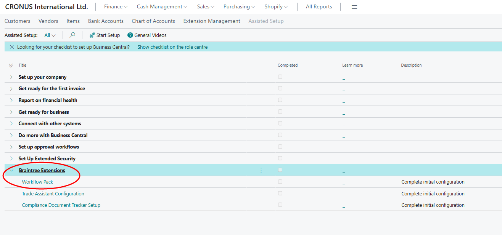
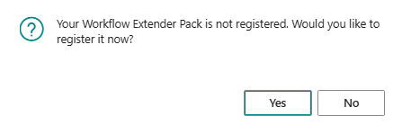
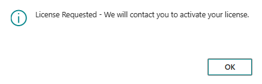
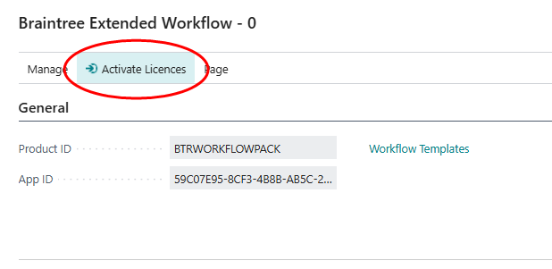
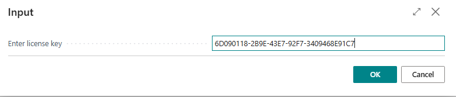
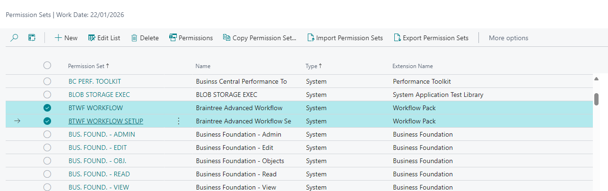

# Setup and Configuration
To start using the Workflow Templates Extension, some initial setup and configuration are required. These steps ensure that the workflows are tailored to your organisation's needs and function seamlessly within your Microsoft Dynamics 365 Business Central environment.

## Installation and Licensing
- Install the Workflow Templates Extension in your Business Central environment from Microsoft AppSource. The Workflow app will be added to the Manual Setup and Assisted Setup lists, under the group 'Braintree'.

    

- When the app has installed, you will be prompted to request a licence:

    

- Click on Yes. A licence registration request will be sent to Braintree. You will receive the following message:

    

- Click on OK. A Braintree service agent will send you a registration via email. When you receive the key, click on 'Activate Licence' from the Setup page:

    

- Copy and paste the key provided into the dialog, and click OK:

    

## Create workflows
- Create specific workflows from the new templates, using normal Business Central workflow tools.
- Edit the new workflow to set up your conditions and approval rules.
- Enable the workflow.

## Permission Sets
Two permission sets were added to the Extension:
- "BTWF WORKFLOW": Required for all users to access new functionality.
- "BTWF WORKFLOW SETUP": Required for administrators to perform administrative tasks, including setup of the Approved Item Sales Margins.

 

[**⬆️ Back to Top**](#setup-and-configuration) &nbsp;&nbsp;&nbsp;&nbsp; [**🏠 Home**](/BC-Workflow-Pack)