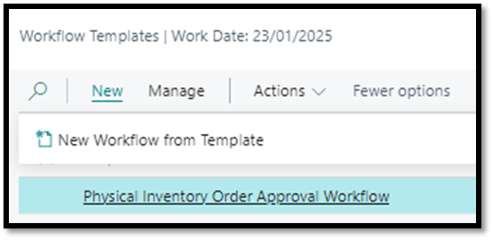
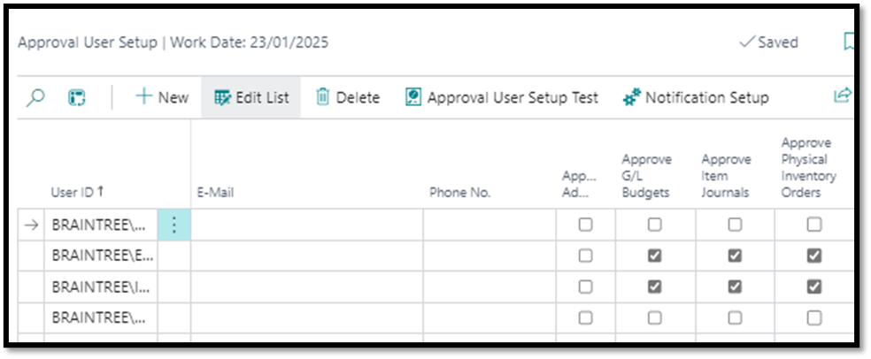

# Braintree Advanced Workflow Pack

## Setup and Configuration

To start using the Workflow Templates Extension, some initial setup and configuration are required. These steps ensure that the workflows are tailored to your organisation's needs and function seamlessly within your Microsoft Dynamics 365 Business Central environment.

### 2.1. Setup Overview
1.	Install the Workflow Templates Extension in your Business Central environment.
2.	Create new workflow from specific templates relevant to your business, such as G/L Budget Approval Workflow or Sales Price Margin Approval Workflow.
3.	Define key settings such as conditions (e.g., Total Amount thresholds) within the specific workflow.
4.	Set up approval hierarchies and configure user access to specific workflows.

Detailed guidance for setting up and configuring each workflow template is provided in the following sections.

### 2.2.	Permission Sets
Two permission sets were added to the Extension:
1.	BTWF WORKFLOW: Required for all users to access new functionality.
2.	BTWF WORKFLOW SETUP: Required for administrators to perform administrative tasks, including setup of the Approved Item Sales Margins.

## 3. <a name="_toc3">G/L Budget Approval Workflow</a>
1. Navigate to Workflow Templates
2. Select G/L Budget Approval Workflow
3. Click on New
4. Click on New Workflow from Template

5. Capture desired conditions such as who the approver should be
- Under Approval User Setup, the “Approve G/L Budgets” field should be ticked for the specified approver

 
 
 
6. Once satisfied that all necessary conditions have been stipulated, workflow can be enabled
   
### Test Instructions
1.	Navigate to G/L Budgets
-   Open the G/L Budgets page in Business Central.
2.	Create a New Budget
-   Click on New to create a budget.
-   Provide the necessary details for the budget.

3.	Edit Budget
-   Click on Edit Budget to open the budget for editing.
-   Enter the required values in the budget lines.
4.	Attempt to Release the Budget
-   Click Release without sending for approval.
-   Verify the system displays the message: 
    -	_"This document can only be released when the approval process is complete."_

 
5.	Send for Approval
-   Click on Send Approval Request to initiate the approval process.
-   Confirm that the Status changes to Pending Approval.

 
6.	**Approver Notification**: Verify that the approver receives a notification about the approval request.
7.	**Approval Process**: Simulate or allow the approver to approve the request.
8.	**Confirm Release**: Ensure the Status of the budget changes to Released after approval is granted.

## 4. <a name="_toc4">General Journal Batch Approval Workflow</a>
1. Note: This workflow already exists but has been extended to include functionality for defining conditions based on Total Amount thresholds.
2. Navigate to Workflow Templates
3. Select General Journal Batch Approval Workflow
4. Click on New
5. Click on New Workflow from Template

 
6. Capture desired condition for example Total Amount (LCY) > 50000

 
7. Once satisfied that all necessary conditions have been stipulated, workflow can be enabled

### Test Instructions
1.	Navigate to General Journals
-   Select General Journal Template
-   Populate accordingly (to test that the workflow works, ensure that the amount is greater than amount captured in condition)
2.	Attempt to Post the journal
-   Verify the system displays the message: 
    - _"You cannot use Gen. Journal Line: GENERAL,DEFAULT,10000 for this action.
The restriction was imposed because the journal batch requires approval."_
3.	Send for Approval
-   Click on Send Approval Request to initiate the approval process.
-   Confirm that the Status changes to Pending Approval.

 
4.	Approver Notification
-   Verify that the approver receives a notification about the approval request.
5.	Approval Process
-   Simulate or allow the approver to approve the request.
6.	Confirm Release
-   Ensure the Status of the budget changes to Released after approval is granted.
 
## 5. <a name="_toc5">Item Journal Approval Workflow</a>
1.  Navigate to Workflow Templates
2.  Select Item Journal Approval Workflow
3.  Click on New
4.  Click on New Workflow from Template
   

5. Capture desired conditions such as who the approver should be
-   Under Approval User Setup, the “Approve Item Journals” field should be ticked for the specified approver

6. Once satisfied that all necessary conditions have been stipulated, workflow can be enabled

###	Test Instructions
1.	Navigate to Item Journals
-   Select Item Journal Template
-   Populate accordingly
2.	Attempt to Post the journal
-   Verify the system displays the message: 
    - _"This document can only be released when the approval process is complete."_
3.	Send for Approval
-   Click on Send Approval Request to initiate the approval process.
-   Confirm that the Status changes to Pending Approval.

 

4.	Approver Notification
-   Verify that the approver receives a notification about the approval request.
5.	Approval Process
-   Simulate or allow the approver to approve the request.
6.	Confirm Release
-   Ensure the Status of the journal changes to Released after approval is granted.
 
## 6. <a name="_toc6">Physical Inventory Order Approval Workflow</a>
1. Navigate to Workflow Templates
2. Select Physical Inventory Order Approval Workflow
3. Click on New
4. Click on New Workflow from Template

 

5. Capture desired conditions such as who the approver should be
-   Under Approval User Setup, the “Approve Physical Inventory Orders” field should be ticked for the specified approver

 

 
6. Once satisfied that all necessary conditions have been stipulated, workflow can be enabled

###	Test Instructions
1.	Navigate to Physical Inventory Orders
-   Create new order
-   Populate accordingly
2.	Attempt to Post the Order
-   Verify the system displays the message: 
    - _"This document can only be released when the approval process is complete."_
3.	Send for Approval
-   Click on Send Approval Request to initiate the approval process.
-   Confirm that the Status changes to Pending Approval.

 

 
4.	Approver Notification
-   Verify that the approver receives a notification about the approval request.
5.	Approval Process
-   Simulate or allow the approver to approve the request.
6.	Confirm Release
-   Ensure the Status of the order changes to Released after approval is granted.

## 7. <a name="_toc7">Sales Price Margin Approval Workflow</a>
1. Navigate to Approved Item Sales Margins
2. Set up all specific rules required such as below example

 

3. Navigate to Workflow Templates
4. Select Sales Price Margin Approval Workflow
5. Click on New
6. Click on New Workflow from Template

 

7. Capture desired conditions such as who the approver should be

### Test Instructions
1.	Navigate to Sales Orders
-   Create new order
-   Populate accordingly
2.	Attempt to Release the Order
-   Verify the system displays the message: 
    - _"This document can only be released when the approval process is complete."_
3.	Send for Approval
-   Click on Send Approval Request to initiate the approval process.
-   Confirm that the Status changes to Pending Approval.
-   Take note of two additional fields: Margin % and Below Margin, which assist the approver in quickly reviewing the margin on the line(s).
 
 

4.	Approver Notification: Verify that the approver receives a notification about the approval request.
5.	Approval Process: Simulate or allow the approver to approve the request.
6.	Confirm Release: Ensure the Status of the Sales Order changes to Released after approval is granted.

## 8. <a name="_toc8">Troubleshooting</a>
If you encounter any issues or errors while using the Workflow Templates Extension, follow the troubleshooting steps below:

1. Review Template Configuration: Ensure that the workflow templates are configured correctly, including conditions, responses, and required fields.
2. Check System Settings: Verify that the general system settings related to workflows are properly set up and aligned with your business processes.
3. Validate User Permissions: Ensure that the user triggering the workflow or managing templates has the necessary permissions.
4. Test Template Functionality: Run a test using the problematic template to isolate the issue and confirm whether it is specific to that template or affects others as well.
5. Contact Support: If the issue persists, reach out to the support team, providing details such as error messages and the steps leading to the problem for efficient troubleshooting.
