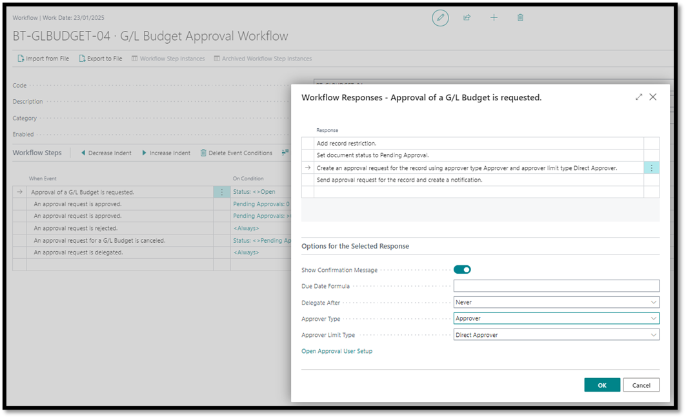
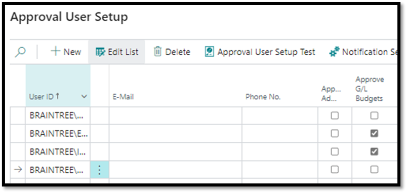
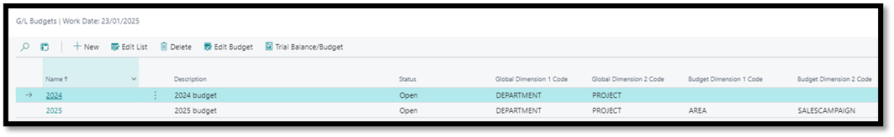

# G/L Budget Approval Workflow
1. Navigate to Workflow Templates
2. Select G/L Budget Approval Workflow
3. Click on New
4. Click on New Workflow from Template

5. Capture desired conditions such as who the approver should be
- Under Approval User Setup, the “Approve G/L Budgets” field should be ticked for the specified approver

 
 
 
6. Once satisfied that all necessary conditions have been stipulated, workflow can be enabled
   
## Test Instructions
1.	Navigate to G/L Budgets
-   Open the G/L Budgets page in Business Central.
2.	Create a New Budget
-   Click on New to create a budget.
-   Provide the necessary details for the budget.

3.	Edit Budget
-   Click on Edit Budget to open the budget for editing.
-   Enter the required values in the budget lines.
4.	Attempt to Release the Budget
-   Click Release without sending for approval.
-   Verify the system displays the message: 
    -	_"This document can only be released when the approval process is complete."_

 
5.	Send for Approval
-   Click on Send Approval Request to initiate the approval process.
-   Confirm that the Status changes to Pending Approval.

6.	**Approver Notification**: Verify that the approver receives a notification about the approval request.
7.	**Approval Process**: Simulate or allow the approver to approve the request.
8.	**Confirm Release**: Ensure the Status of the budget changes to Released after approval is granted.

[**⬆️ Back to Top**](#gl-budget-approval-workflow) &nbsp;&nbsp;&nbsp;&nbsp; [**🏠 Home**](/BC-Workflow-Pack)