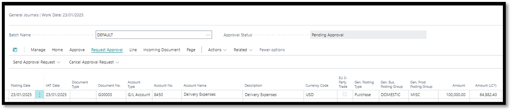

# Braintree Advanced Workflow Pack

## 4. <a name="_toc4">General Journal Batch Approval Workflow</a>
1. Note: This workflow already exists but has been extended to include functionality for defining conditions based on Total Amount thresholds.
2. Navigate to Workflow Templates
3. Select General Journal Batch Approval Workflow
4. Click on New
5. Click on New Workflow from Template

 
6. Capture desired condition for example Total Amount (LCY) > 50000

 
7. Once satisfied that all necessary conditions have been stipulated, workflow can be enabled

### Test Instructions
1.	Navigate to General Journals
-   Select General Journal Template
-   Populate accordingly (to test that the workflow works, ensure that the amount is greater than amount captured in condition)
2.	Attempt to Post the journal
-   Verify the system displays the message: 
    - _"You cannot use Gen. Journal Line: GENERAL,DEFAULT,10000 for this action.
The restriction was imposed because the journal batch requires approval."_
3.	Send for Approval
-   Click on Send Approval Request to initiate the approval process.
-   Confirm that the Status changes to Pending Approval.

 
4.	Approver Notification
-   Verify that the approver receives a notification about the approval request.
5.	Approval Process
-   Simulate or allow the approver to approve the request.
6.	Confirm Release
-   Ensure the Status of the budget changes to Released after approval is granted.