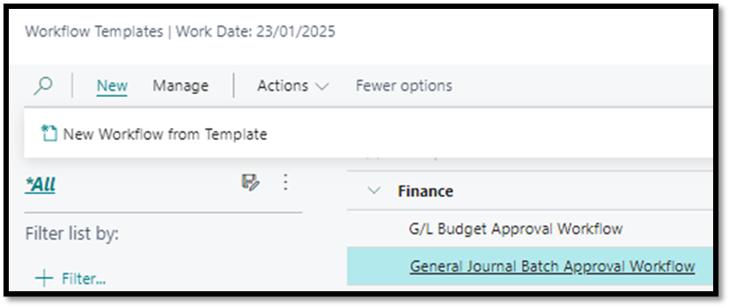

# General Journal Batch Approval Workflow
- Note: This workflow already exists but has been extended to include functionality for defining conditions based on Total Amount thresholds.
- Navigate to Workflow Templates
- Select General Journal Batch Approval Workflow
- Click on New
- Click on New Workflow from Template

 
- Capture desired condition for example Total Amount (LCY) > 50000

 
- Once satisfied that all necessary conditions have been stipulated, workflow can be enabled

### Test Instructions
- Navigate to General Journals
  - Select General Journal Template
  - Populate accordingly (to test that the workflow works, ensure that the amount is greater than amount captured in condition)
-	Attempt to Post the journal
  - Verify the system displays the message: 
  - _"You cannot use Gen. Journal Line: GENERAL,DEFAULT,10000 for this action.
The restriction was imposed because the journal batch requires approval."_
- Send for Approval
  - Click on Send Approval Request to initiate the approval process.
  - Confirm that the Status changes to Pending Approval.

- Approver Notification
  Verify that the approver receives a notification about the approval request.
- Approval Process
  Simulate or allow the approver to approve the request.
- Confirm Release
  Ensure the Status of the budget changes to Released after approval is granted.
  

[**⬆️ Back to Top**](#general-journal-batch-approval-workflow) &nbsp;&nbsp;&nbsp;&nbsp; [**🏠 Home**](/BC-Workflow-Pack)