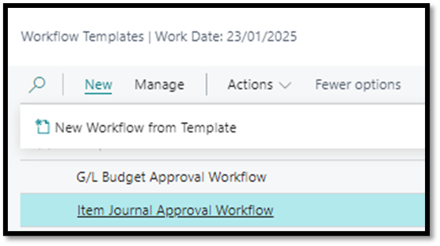

# Item Journal Approval Workflow
- Navigate to Workflow Templates
- Select Item Journal Approval Workflow
- Click on New
- Click on New Workflow from Template
   

- Capture desired conditions such as who the approver should be
  Under Approval User Setup, the “Approve Item Journals” field should be ticked for the specified approver

- Once satisfied that all necessary conditions have been stipulated, workflow can be enabled

##	Test Instructions
- Navigate to Item Journals
  - Select Item Journal Template
  - Populate accordingly
- Attempt to Post the journal
  - Verify the system displays the message: 
  - _"This document can only be released when the approval process is complete."_
- Send for Approval
  - Click on Send Approval Request to initiate the approval process.
  - Confirm that the Status changes to Pending Approval.

 

-	Approver Notification
    Verify that the approver receives a notification about the approval request.
-	Approval Process
    Simulate or allow the approver to approve the request.
-	Confirm Release
    Ensure the Status of the journal changes to Released after approval is granted.

[**⬆️ Back to Top**](#item-journal-approval-workflow) &nbsp;&nbsp;&nbsp;&nbsp; [**🏠 Home**](/BC-Workflow-Pack)