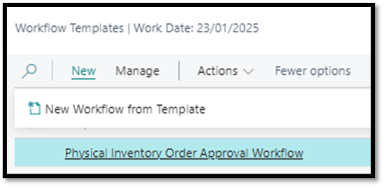
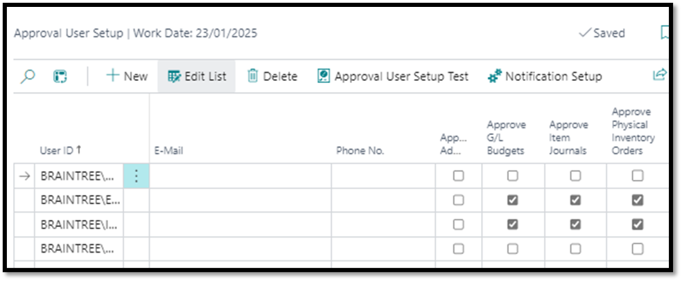
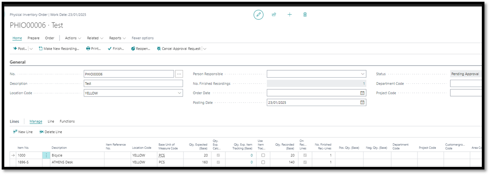

# Physical Inventory Order Approvals
- Navigate to Workflow Templates
- Select Physical Inventory Order Approval Workflow
- Click on New
- Click on New Workflow from Template

 

- Capture desired conditions such as who the approver should be
- Under Approval User Setup, the “Approve Physical Inventory Orders” field should be ticked for the specified approver

 

- Once satisfied that all necessary conditions have been stipulated, workflow can be enabled

##	Test Instructions
- Navigate to Physical Inventory Orders
  - Create new order
  - Populate accordingly
- Attempt to Post the Order
  - Verify the system displays the message: 
  _"This document can only be released when the approval process is complete."_
- Send for Approval
  - Click on Send Approval Request to initiate the approval process.
  - Confirm that the Status changes to Pending Approval.

 

- Approver Notification
  Verify that the approver receives a notification about the approval request.
- Approval Process
  Simulate or allow the approver to approve the request.
- Confirm Release
  Ensure the Status of the order changes to Released after approval is granted.
  

[**⬆️ Back to Top**](#physical-inventory-order-approval-workflow) &nbsp;&nbsp;&nbsp;&nbsp; [**🏠 Home**](/BC-Workflow-Pack)