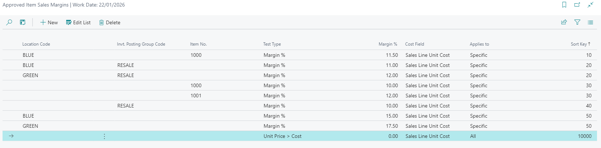
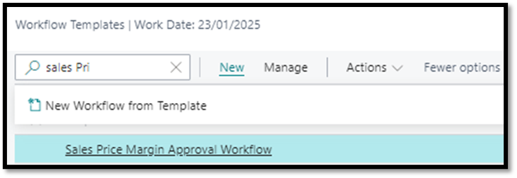
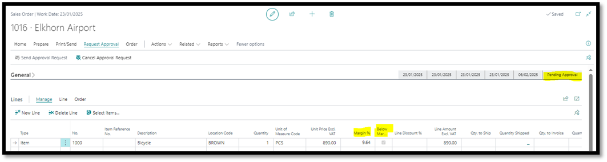

# Sales Price Margin Approval Workflow
- Navigate to Approved Item Sales Margins
- Set up all specific rules required such as below example

 

- Navigate to Workflow Templates
- Select Sales Price Margin Approval Workflow
- Click on New
- Click on New Workflow from Template

 

- Capture desired conditions such as who the approver should be

## Test Instructions
- Navigate to Sales Orders
  - Create new order
  - Populate accordingly
- Attempt to Release the Order
  - Verify the system displays the message: 
     _"This document can only be released when the approval process is complete."_
- Send for Approval
- Click on Send Approval Request to initiate the approval process.
- Confirm that the Status changes to Pending Approval.
- Take note of two additional fields: Margin % and Below Margin, which assist the approver in quickly reviewing the margin on the line(s).
 
 

- Approver Notification: Verify that the approver receives a notification about the approval request.
- Approval Process: Simulate or allow the approver to approve the request.
- Confirm Release: Ensure the Status of the Sales Order changes to Released after approval is granted.

[**⬆️ Back to Top**](#sales-price-margin-approval-workflow) &nbsp;&nbsp;&nbsp;&nbsp; [**🏠 Home**](/BC-Workflow-Pack)